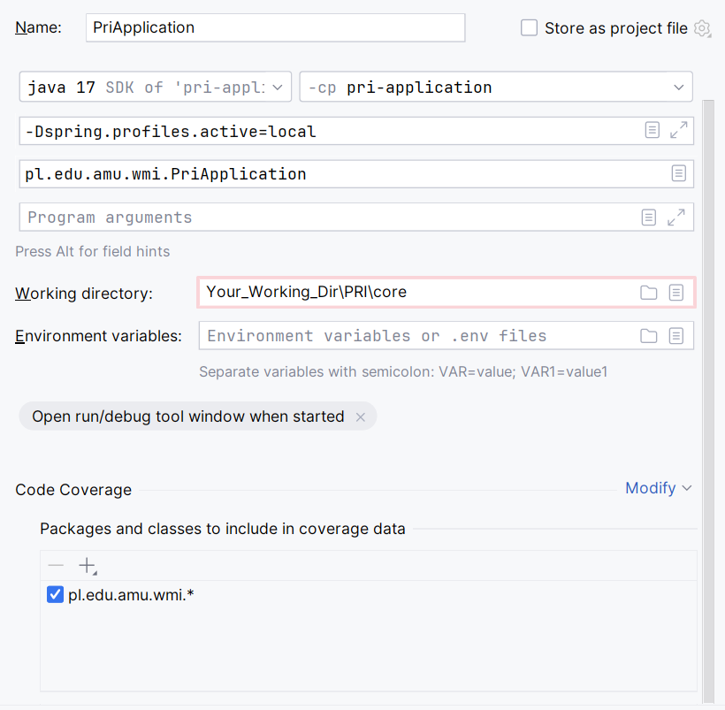

# PRI 2.0 - System Backand Application

## List of modules

| Module                  | Description                                                  | Application Version |
|-------------------------|--------------------------------------------------------------|---------------------|
| aggregated-test-report  | creates aggregated test report (using jacoco)                | 1.5.0               |
| auth                    | responsible for authentication                               | 1.5.0               |
| data-feed               | allow to import / export data to the system using csv format | 1.5.0               |
| defense-schedule        | responsible for defense schedule process                     | 1.5.0               |
| domain                  | the database model containing db history (liquibase)         | 1.5.0               |
| notification-management | responsible for sending notifications to users               | 1.5.0               |
| permission-management   | management of user's permissions                             | 1.5.0               |
| persistence             | the layer with database operations)                          | 1.5.0               |
| pri-application         | module containing the main class                             | 1.5.0               |
| project-management      | creating and updating the project                            | 1.5.0               |
| user-management         | responsible for user management                              | 1.5.0               |
| criteria-project        | contains individual project criteria                         | 2.0.0               |
| project-market          | contains project market functionality                        | 2.0.0               |

## Technology stack:

| Name                       | Used Technology                                         |
|----------------------------|---------------------------------------------------------|
| language                   | java 17                                                 |
| building tool              | maven                                                   |
| framework                  | Spring Boot                                             |
| database                   | PostgreSQL                                              |
| database change management | Liquibase                                               |
| database for tests         | H2                                                      |
| authentication             | LDAP, jwt token                                         |
| mapping                    | MapStruct                                               |
| logging                    | SLF4j                                                   |
| unit testing               | maven surefire plugin                                   |
| integration testing        | maven failsafe plugin, RestAssured, MockMvc             |
| code coverage              | jacoco                                                  |
| others                     | lombok, springdoc-openapi, FreeMarker, OpenCSV, Jackson |

## Architecture
System is build based on the modular layered architecture.
* Model Layer - all entities are defined withing the module `domain`
* Data Access Layer - all repositories are placed in the module `persistence`
* Service and Controller layers are defined withing each functional module (respectively: `service` and `controller` packages within the module)

## Feature flags

List of feature flags:

| Feature Flag                            | Bahaviour                                                                                                                                                            |
|-----------------------------------------|----------------------------------------------------------------------------------------------------------------------------------------------------------------------|
| `FF_EMAIL_TO_UNIVERSITY_DOMAIN_ENABLED` | `false` - e-mails that contain the domain defined in the variable `EMAIL_UNIVERSITY_DOMAIN` are always sent                                                          |
| `FF_LDAP_AUTHENTICATION_ENABLED`        | `false` - mock authaticantion is used<br/>`true` - real ldap is used for authentication                                                                              |

## Scheduled jobs
To enable scheduled jobs, the variable `SCHEDULED_JOBS_ENABLED` has to be set to `true`

List of scheduled jobs:

| Scheduled job                       | Behaviour                                                                                                                                                                                                                  |
|-------------------------------------|----------------------------------------------------------------------------------------------------------------------------------------------------------------------------------------------------------------------------|
| `EvaluationCardFreezeScheduledJob`  | job freezes the semester evaluation card in the defense day (and creates the evaluation card in phase defense)<br/> After freezing process, user with `STUDENT` role does not see the grades till the grades are published |


📢 IMPORTANT!: PRI 1.0 had implemented ssl certificates generation inside the backend of the application, however it's bad programming practice to put that functionality in the code of an application so this functionality isn't in use and the university has its own proxy for this. Due to this factor there is some legacy code in the application associated with this.


## How to run application locally:

### Prerequisites

* installation of: maven, java 17, Postgres
* creation of Postgres database
* substitution of all environment variables (see [config.env.example](https://github.com/Projekt-Inzynierski-PRI-KKWJ/deploy/config.env.example) file)

### Step-by-step launching instructions:
1. Create folder named e.g. PRI, in place where you want to store the application files.
2. Inside create 3 folders: core, UI, deploy.
3. Clone git core repository core the core folder.
4. Create empty Postgres database. (The schema will be initiated and filled when the backend starts)
5. Run it on the command line providing the values for all the secrets as given in e.g. below or configure your IDE.
    
   Command line:
   "mvn clean package"
   "java -jar -Dspring.profiles.active=local -DPOSTGRES_URL=jdbc:postgresql://localhost:NUMERPORTU/ -DPOSTGRES_USER=POSTGRESUSER -DPOSTGRES_PASSWORD=PASSWORD -DPOSTGRES_DB=DATABASENAME -DJWT_SECRET=JWTSECRET -DMAIL_HOST=host.docker.internal -DMAIL_PORT= -DMAIL_USERNAME= -DMAIL_PASSWORD= -DEMAIL_UNIVERSITY_DOMAIN= -DLDAP_URL= -DLDAP_BASE= -DLDAP_DOMAIN= -DFF_EMAIL_TO_UNIVERSITY_DOMAIN_ENABLED=false -DFF_LDAP_AUTHENTICATION_ENABLED=false -DSCHEDULED_JOBS_ENABLED=false pri-application/target/pri-application-1.0-SNAPSHOT.jar"

   IDE configuration e.g. IntelliJ. Click on three dots next to run button, and then -> Edit -> Modify options -> Add VM options and fill the fields:
   
   Press Apply and the Run button should appear, click it after providing the values in `src/main/resources/application-local.properties`

6. . The application compiles and hopefully works.
7. Assuming you have frontend running and database operational, navigate to `http://localhost:4200/`. 
8. First site that should open is initialization page for coordinator/admin of the system. ( If you run the project locally with mock users, use the exact logins specified in "core\pri-application\src\main\resources\ldap-mock-data.ldif" next to "uid:", name and last name specified next to "cn:", "sn:" values. uid=indexNumber. )
9. After successful initialization login site should appear, log in to coordinator account. 
10. When in the system, proceed to data-feed tab to import supervisors, students and criteria in .csv files ( If  running locally import Test-mock students, supervisors and criteria from the support files folder in deploy directory ).
11. Before you will be able to add project you need to configure the supervisor availability in Project tab when clicking on Supervisor Availability button.

#### Secrets

Secrets must be defined as `java` command arguments (see **Starting the application**)
or provided to the IDE as e.g. ENV variables - depending on the run method.

#### Authentication

To use mocked ldap authentication for local run:
* the variable `ldap.authentication.enabled` has to be set to `false`
* mocked ldap data are in the file `core\pri-application\src\main\resources\ldap-mock-data.ldif`
* 📢 IMPORTANT!: Password for mock ldap accounts is: "Haslo123".

#### Coordinator user

First site that apperas after system is initiated is initialization of coordinator unlees the user_data tabel is not empty.
( If you run the project locally with mock users, use the exact logins specified in "core\pri-application\src\main\resources\ldap-mock-data.ldif" next to "uid:", name and last name specified next to "cn:", "sn:" values. )
📢 IMPORTANT!: uid=indexNumber.

#### Liquibase

To generate the "liquibase-diffChangeLog.xml" with changes made in domain module and generate the .xml file with changes to database schema:
(e.g. when new entities were added):
1. Database need to be already initialized so the liquibase can compare the entities in domain module with already existing ones and generate the .xml changes file.
2. Navigate to the domain module using e.g.: `cd domain` and then execute: `mvn liquibase:diff` to generate "core\domain\src\main\resources\liquibase-diffChangeLog.xml".
3. After the changes are generated, review them, and if they are ok, copy the contents of the "liquibase-diffChangeLog.xml" file and then pasted them into new changeset in "core\domain\src\main\resources\config\liquibase\database" similar to others that are already there.
4. Add the new file to "core\domain\src\main\resources\config\liquibase" similar to the others that are added there.
5. When you run the project next time the changeste should be executed and database schema should be changed.

📢 IMPORTANT!: Be sure, that the database connection details are set in the `core\domain\src\main\resources\liquibase.properties` file.

#### Profile

Run application with the profile `local` 

### Starting the application

To run the application, use an IDE build in option (e.g. in IntelliJ) or execute in command line:

```
mvn clean package
java -jar -Dspring.profiles.active=local <environment variables> pri-application/target/pri-application-1.0-SNAPSHOT.jar 
// before execution check the name of the jar file
// as <environment variables> put all variables from config.env.example file (e.g. -DPOSTGRES_URL=${POSTGRES_URL} -DPOSTGRES_DB=${POSTGRES_DB})
```
## How to run application using docker:

Check out [deploy](https://github.com/Projekt-Inzynierski-PRI-KKWJ/deploy) repository.

## Tests:

To run the unit tests, run the command:

```
mvn clean package
```

To run all tests (unit tests and integration tests) with code coverage, run the command:

```
mvn clean verify
```

The aggregated test report is created in aggregated-test-report module (path: `core\aggregated-test-report\target/site/jacoco-aggregate/index.html`) 